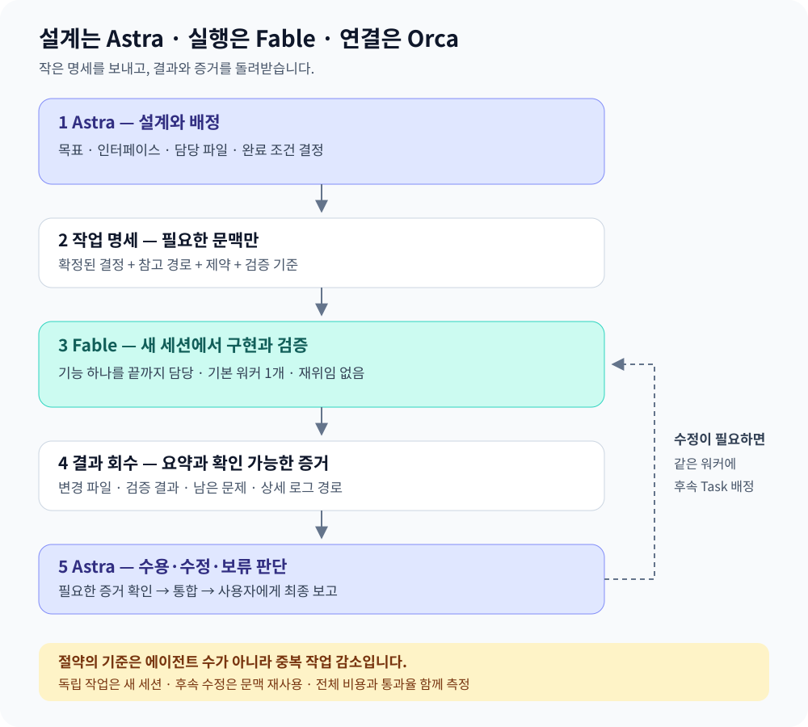

# Astra가 설계하고 Fable이 실행하는 Orca 운영 가이드

> 2026-09-10 조사 기반 제안. CLI 기능과 로컬 설정은 확인했지만, 이 구성으로 워커를 실행하거나 절감률을 측정하지 않았다. 모델·가격·옵션은 실행 시 다시 확인한다.

Astra는 요구사항·설계·작업 배정·최종 판단을 맡고, Fable은 별도 세션에서 맡은 기능을 구현하고 검증한다. **대화 전체 대신 작은 작업 명세를 보내고, 결과와 증거만 돌려받는 것**이 핵심이다.

바로 따라 하려면 [실전 사용법: 설정부터 결과 회수까지](astra-fable-practical-guide.md)를 읽는다. 사용자 입력 예시와 단계별 행동 도식을 포함한다.



## 1. 무엇이 절약되는가

| 목적 | 효과가 생기는 조건 | 오해하지 말아야 할 점 |
| --- | --- | --- |
| Astra 문맥 절약 | 워커의 탐색·로그를 요약하고 필요한 증거만 회수 | 워커 토큰은 별도로 소비된다 |
| 제공자 사용량 분산 | 서로 다른 제공자·계정의 이용 조건에 맞춰 실행 | 새 세션이 같은 계정의 한도를 초기화하지는 않는다 |
| 전체 비용 절약 | 중복 탐색·긴 출력·재작업을 줄이고 적합한 경량 모델 활용 | Fable로 바꾸는 것만으로 저렴해지지 않는다 |
| 완료 시간 단축 | 파일 소유권과 의존성이 분리된 작업을 병렬 실행 | 병렬화는 토큰 절약과 별개다 |

조사 당시 Astra와 Fable의 표준 API 입력·출력 단가는 같았고 캐시 읽기 단가는 달랐다. 구독 소비량, 실제 청구액, API 환산 비용은 분리해서 기록한다. 최신 수치는 [Astra 가격](https://developers.openai.com/api/docs/models/gpt-6-astra)과 [Fable 가격](https://platform.claude.com/docs/en/models/fable-5-1/overview)을 확인한다.

## 2. 누구에게 무엇을 맡길까

| 담당 | 맡길 일 | 반환할 것 |
| --- | --- | --- |
| Astra 조정자 | 요구사항, 설계, 완료 조건, 충돌 해결, 통합 판단 | 작업 명세, 수용·수정·보류 결정 |
| Fable 구현 워커 | 명세가 정해진 기능 구현, 복잡한 버그 수정, 관련 검증 | 변경 파일, 검증 결과, 남은 문제와 근거 |
| 선택적 경량 워커 | 좁은 탐색, 자료 추출, 반복 문서 작업 | 근거 경로와 짧은 결과 |
| 별도 리뷰어 | 작업 위험에 맞는 외부 검토 | 위치·재현 조건·영향이 있는 지적 |

이는 초기 역할 가설이다. 모델별 우열을 단정하지 않고 실제 프로젝트 과제로 평가한다. Fable이 구현한 결과를 Fable의 자기 검토만으로 독립 리뷰 완료라고 하지 않는다. 리뷰 대상·모델·effort는 적용되는 개인 및 프로젝트 리뷰 정책을 따른다.

## 3. 새 세션과 기존 세션을 고르는 기준

| 상황 | 선택 | 이유 |
| --- | --- | --- |
| 오탈자·명확한 한 줄 수정 | 현재 Astra 세션에서 처리 | 위임 설명이 작업보다 커질 수 있음 |
| 독립 기능 하나, 완료 조건이 명확함 | 새 Fable 세션 | 필요한 문맥만 전달 가능 |
| 방금 만든 기능의 실패 수정 | 같은 Fable 워커에 후속 Task | 이미 읽은 코드와 실패 원인 재사용 |
| 목표가 달라졌거나 무관한 문맥이 많이 쌓임 | 새 세션 + 짧은 체크포인트 | 불필요한 이력 전달 방지 |
| 같은 파일을 동시에 고쳐야 함 | 순차 실행 또는 충돌을 해결할 격리 | 덮어쓰기·통합 재작업 방지 |

**새 세션은 새 worktree와 다르다.** 기본은 현재 worktree에서 파일 소유권을 분리한다. 구체적인 충돌이 있을 때만 별도 worktree를 고려한다. Worktree를 나눠도 DB·포트·외부 서비스는 자동 분리되지 않는다.

처음에는 Astra 1개와 구현 워커 1개로 시작한다. 독립 작업에만 동시 워커를 2개로 늘리고, 워커의 재위임은 하지 않는다. 구현 effort는 `high`를 초기 평가 후보로 삼되 어려운 쟁점에만 높인다. 이 권고가 기존 리뷰 effort 정책을 변경하지는 않는다.

## 4. 복사해서 쓰는 작업 명세

```text
목표: 사용자가 확인할 수 있는 결과
설계 결정: 이미 확정된 동작·인터페이스
담당 파일: 수정 가능한 범위와 다른 작업자의 소유권
참고 파일: 필요한 코드·문서의 경로
제약: 보존할 계약, 기존 변경, 운영 접근·커밋·배포 범위
완료 조건: 동작과 이를 입증할 검증
상향 보고: 설계 변경 필요 또는 같은 원인으로 반복 실패
반환: 변경 요약, 파일, 검증 결과, 남은 문제, 증거 경로
재위임: 하지 않음
```

예: “지식 문서의 빈 검색 결과 안내를 개선한다. 기존 검색 계약과 사용자 변경을 보존한다. 지정한 컴포넌트만 수정하고 검색어 초기화 동작과 모바일 레이아웃을 확인한다. 커밋·배포 없이 결과와 증거를 반환한다.”

반환 요약은 500~1,000토큰을 초기 목표로 삼되, 실패나 증거를 생략하지 않는다. 상세 로그는 파일로 남기고 Astra가 필요할 때 읽는다. 이 분량은 도구의 강제 제한이 아니다.

```text
결과: succeeded / failed / blocked
변경: 사용자 동작 기준 요약
파일: 실제 수정 경로
검증: 실행 명령·결과·증거 경로 (미실행은 명시)
남은 문제: 재현 조건과 필요한 판단
사용량: 실제 모델·effort·제공되는 토큰/비용·소요 시간
```

`blocked`는 내용상의 보고 상태다. Orca의 최종 `worker_done` outcome은 `succeeded` 또는 `failed`이며, 진행 중 막힘은 `ask` 또는 `escalation`으로 처리한다.

## 5. Orca에서 실행하는 순서

현재 조사에서 Orca는 모델과 effort를 지정한 새 Claude Code 워커 실행, Task/Dispatch 추적, 완료 회수, 워커 정리를 지원했다. 이 대화의 Codex 내장 서브에이전트 모델 목록에는 Fable이 없어 **Orca의 별도 Claude Code 세션**을 권장했다. 다른 클라이언트에서도 동일하다고 일반화하지 않는다.

아래는 설치 당시 CLI 문법을 바탕으로 한 템플릿이며 자동 실행 스크립트가 아니다. `<...>`와 모델 변수는 실제 값으로 채운다. Linux의 이 호스트에서는 `orca-ide`를 사용한다.

```sh
# 실제 설치 버전의 안내와 상태부터 확인
orca-ide skills get orchestration
orca-ide status --json

# 조정자 터미널에서 Run을 만들고 반환된 상태를 확인
orca-ide orchestration run-create --objective "기능 구현 및 결과 통합" --json
orca-ide orchestration task-create --spec "<자기완결적인 작업 명세>" --json

# task_id는 직전 응답에서 가져온다.
# FABLE_MODEL_ID는 계정에서 확인한 정확한 Fable 5.1 모델 ID다.
orca-ide orchestration worker-start \
  --task <task_id> --worktree current --agent claude \
  --model "$FABLE_MODEL_ID" --effort high --json

orca-ide orchestration check \
  --wait --types worker_done,escalation,question --timeout-ms 60000 --json
```

실행 응답의 `launch.requested`·`launch.effective`를 확인하고 실제 요청 기록의 모델과 대조한다. 실행 실패·응답 유실 시 기존 Dispatch와 남은 자원을 확인한 뒤 복구한다. 시간 초과만으로 중복 워커를 띄우지 않는다.

완료 메시지는 워커가 주입받은 Task/Dispatch 지침에 따라 보낸다. Astra는 메시지 묶음 전체를 처리하고 질문에 답하며, 수용한 완료 결과의 워커를 즉시 재사용하거나 정리한 뒤 수신을 승인한다.

```sh
# 완료된 Dispatch만 정리한다. 실행 중 워커에는 사용하지 않는다.
orca-ide orchestration worker-release --dispatch <dispatch_id> --json
orca-ide orchestration check --ack <delivery_id> --json
```

즉시 후속 작업이 있으면 정리 대신 `worker-show`로 확인한 동일 워커 터미널에 새 Task를 배정한다. 모든 예상 Dispatch가 끝날 때까지 결과 회수를 계속한다. Run은 작업 기록과 수신함이며, 작업 충돌과 동시 실행 수는 조정자가 결정한다.

## 6. 절약 여부를 확인하는 작은 실험

대표 과제 6~10개를 같은 시작 코드·완료 조건으로 비교한다. 사용자 변경이나 공유 운영 DB를 실험 초기화 대상으로 삼지 않는다.

| 비교안 | 확인할 질문 |
| --- | --- |
| Astra 단독 | 기준 품질·사용량·시간은 얼마인가? |
| Astra + Fable 새 세션 | Astra 사용량을 분산하면서 통과율을 유지하는가? |
| 위 구성 + 선택적 경량 워커 | 탐색·문서 작업의 전체 비용이 더 낮아지는가? |

기록 항목: 실제 모델·effort, 입력·캐시·출력 사용량, 실제 비용 또는 구독 소비, 경과 시간, 재작업 횟수, 최종 통과율. 제공되지 않는 값은 추정치를 실제 사용량처럼 채우지 않는다. Astra 토큰만 감소하고 전체 비용·재작업이 늘었다면 절약 성공으로 판정하지 않는다.

## 근거와 적용 범위

- [OpenAI 서브에이전트](https://learn.chatgpt.com/docs/agent-configuration/subagents): 모델별 에이전트 구성과 추가 토큰 소비.
- [Claude 서브에이전트](https://code.claude.com/docs/en/sub-agents): 독립 문맥, fork, 같은 대화와 위임의 선택 기준.
- [Orca orchestration](https://github.com/stablyai/orca/blob/main/skill-guides/orchestration.md): Task/Dispatch와 결과 회수. 실행 문법은 설치된 CLI 가이드 우선.
- [Anthropic 멀티에이전트 연구](https://www.anthropic.com/engineering/multi-agent-research-system): 분업·예산·복구의 중요성. 연구 수치를 이 프로젝트의 절감률로 사용하지 않음.

이 문서는 개발 작업 운영 제안이다. gons-dashboard의 애플리케이션 LLM 라우팅 설정이나 운영 환경을 변경하지 않는다.

## 대시보드에서 열기

개발 화면의 **지식 보관함 → Astra 검색 → 기술 매뉴얼**에서 읽을 수 있다.

- [등록된 문서](http://localhost:3020/knowledge/de4eeb5a-49c5-4e75-8c89-b61e9ff136a4) — 저장한 사용자 계정으로 로그인 필요.
- [보관함 검색](http://localhost:3020/knowledge?q=Astra)
- 웹용 도식: `apps/dashboard/public/guides/astra-fable-orchestration.svg`. 원본 도식을 수정할 때 함께 갱신한다.

본문은 정상 문서 작성 화면에서 기술 매뉴얼로 저장했다. 저장소 원문과 자동 동기화되지는 않는다. 개발 서버에서 본문·도식 표시를 확인했으며 운영 배포 확인은 포함하지 않는다.
