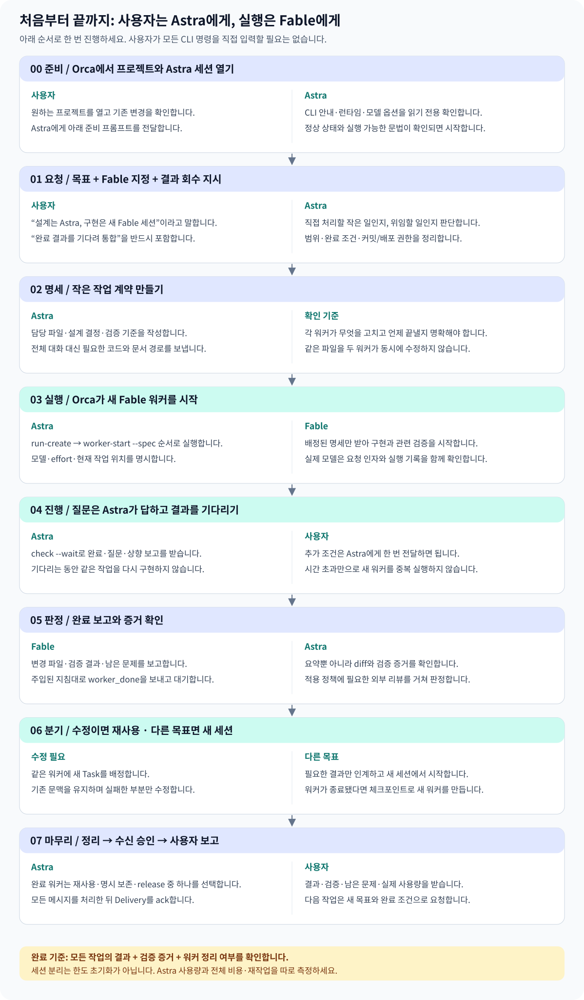

# Astra–Fable 5.1 실전 사용법: 설정부터 결과 회수까지

> 사용 위치: **Orca의 해당 프로젝트 → Astra 세션**. 이 문서는 실행 설명서이며 워커를 실제 실행한 결과가 아니다. 2026-09-10 확인한 CLI 기능·설정을 바탕으로 작성했고, 설치 버전·권한·실제 모델은 실행 시 확인한다.

## 먼저 이해할 것

**사용자는 Astra에게 목표를 말한다 → Astra가 작업을 설계하고 Fable 세션을 시작한다 → Fable이 구현·검증한다 → Astra가 결과를 받아 판단한다.** 사용자가 두 모델 사이에서 내용을 계속 복사할 필요는 없다.

단순히 “다른 에이전트에게 넘겨줘”라고 하면 완전 인계로 해석될 수 있다. **네가 조정자로 남아 완료 결과를 기다리고 통합해줘**라고 말해야 원하는 감독형 위임이 명확해진다.



[단계별 도식 크게 보기](../diagrams/astra-fable-practical-steps.svg)

## 0. 처음 한 번: 환경과 설정

### 어디서 시작하나

1. Orca에서 작업할 프로젝트를 연다. 이 예시는 `gons-dashboard`다.
2. 해당 프로젝트의 Astra 세션을 열거나 현재 Astra 세션을 사용한다.
3. 기존 수정이 있으면 보존하게 한다. 처음부터 새 worktree가 필요한 것은 아니다.
4. 아래 준비 프롬프트를 Astra에게 보낸다. 사용자가 CLI 명령을 직접 입력하지 않아도 된다.

```text
이 프로젝트에서 Astra 조정자 + Fable 5.1 워커 방식으로 작업하려고 해.
아직 워커를 실행하거나 설정을 변경하지 말고 준비 상태만 확인해줘.

- 현재 프로젝트와 기존 git 변경
- 실제 Orca CLI 실행 파일, 런타임 연결 상태
- 설치된 orchestration 스킬과 worker-start의 모델·effort 옵션
- Astra와 Claude Code의 유효한 모델 설정
- 인증·모델 설정 확인과 실제 추론 성공 여부를 구분

비밀값을 출력하지 말고, 준비됨 / 추가 조치 필요 / 미검증으로 보고해줘.
```

### 확인한 설정과 권장 사용법

| 항목 | 확인한 상태 | 실전 권장 |
| --- | --- | --- |
| Astra 기본 모델 | `gpt-6-astra`, effort `medium` | 조정·일상 판단은 유지. 어려운 설계만 별도 판단 |
| Claude Code 기본 모델 | Fable 5.1, effort `xhigh` | 새 구현 워커는 모델과 effort를 명시해 실행 |
| Orca | 실행·연결 정상, 모델/effort 지정 지원 | 기존 기능 사용. 별도 오케스트레이터 서버부터 만들 필요 없음 |
| 실제 Fable 워커 요청 | 이번 설명서 작업에서는 미실행 | 아래 읽기 전용 예제로 처음 검증 |

위 설정은 로컬 CLI 기본값이다. Orca의 실행 옵션이 덮어쓸 수 있으므로 실제 세션과 대조한다. 설정 파일에 모델 이름이 있다고 계정의 사용 권한까지 확인된 것은 아니다.

**기본값을 확인하는 곳**

- Codex: `CODEX_HOME`이 있으면 그 경로의 `config.toml`, 없으면 `~/.codex/config.toml`.
- Claude Code: `~/.claude/settings.json`의 모델/effort와 프로젝트·실행 옵션. 이 파일은 Codex 설정이 아니다.
- Orca: 설치된 `orca-ide skills get orchestration` 안내와 실행 응답. 기능 비활성 오류가 있으면 Orca 설정에서 해당 기능 상태를 확인한다.

이 문서는 전역 설정을 바꾸지 않는다. 우선 **워커 실행마다 `--model`·`--effort`를 지정**하면 다른 세션의 기본값에 영향을 주지 않는다.

Orca 안의 일반 터미널에서 Astra CLI를 직접 시작해야 할 때의 예시:

```sh
codex --model gpt-6-astra -c 'model_reasoning_effort="medium"'
```

이미 Astra 대화가 열려 있으면 다시 실행하지 않는다. Claude를 `claude --model ...`로 직접 여는 것만으로는 Orca Task/Dispatch 추적이 붙지 않는다. 감독형 실행은 아래 `worker-start`를 사용한다.

### 에이전트 정의 파일이 꼭 필요한가

처음에는 필요 없다. **모델 + 작업 명세 + 도구 실행 권한 + 완료 보고 계약**으로 워커를 구성할 수 있다. 매번 같은 문구를 쓰기 번거로워질 때 프로젝트 지침이나 전용 스킬로 묶는다. 아래는 선택적으로 지침에 넣을 정책 예시이며 자동 적용된 설정은 아니다.

```text
사용자가 Orca 감독형 위임을 요청하면 Astra가 설계·배정·통합을 맡는다.
구현은 Fable 5.1의 새 세션에 자기완결적인 명세로 맡긴다.
전체 대화 복제 없이 목표·관련 경로·제약·완료 조건만 전달한다.
기본 워커 1개, 명확히 독립적인 작업만 최대 2개. 워커 재위임은 금지한다.
같은 기능의 후속 수정은 가능한 한 같은 워커에 새 Task로 맡긴다.
완료 결과를 기다려 증거와 함께 판단하고 워커 정리까지 마친다.
작은 수정은 직접 수행한다. 기존 변경·리뷰 정책·승인 범위를 유지한다.
```

## 1. 첫 연습: 파일을 바꾸지 않는 위임

처음에는 작은 읽기 전용 작업으로 **모델 실행 → 결과 회수 → 정리**가 연결되는지 확인한다. 다음을 Astra에게 그대로 보낸다.

```text
Orca orchestration으로 실행해줘. 네가 Astra 조정자로 남아 감독해.
새 Claude Code 세션의 Fable 5.1 / high 워커 1개를 시작해줘.

작업: 현재 프로젝트의 루트와 dashboard package.json에서
개발 서버·타입 검사·린트·테스트 명령을 찾아 표로 정리해줘.
파일 수정, 패키지 설치, 테스트 실행, 커밋, 푸시는 하지 마.
근거 파일 경로와 확인한 명령만 반환하게 해줘.

전체 대화를 넘기지 말고 이 명세와 필요한 경로만 전달해.
완료 결과를 기다려 실제 실행 모델 확인 수준, Task/Dispatch,
결과와 근거를 보고하고 완료 워커를 정리해줘.
모델이 없거나 인증에 실패하면 다른 모델로 자동 대체하지 마.
```

**성공하면 볼 것:** 워커가 어떤 모델로 시작했는지, 발견한 명령 표, 근거 경로, 완료 결과, 정리 여부. 시작 명령 성공만 있고 결과가 돌아오지 않았다면 아직 전체 경로를 확인한 것이 아니다.

## 2. 실제 구현: 기능 하나를 끝까지 맡기기

예시는 “지식 검색의 빈 결과 안내 개선”이다. 실제 요구사항에 맞게 목표와 완료 조건을 바꾸면 된다.

```text
gons-dashboard의 지식 보관함에서 검색 결과가 없을 때
검색 조건과 초기화 방법을 쉽게 알 수 있도록 개선해줘.

Astra인 네가 현재 코드를 필요한 만큼 확인해 동작과 완료 조건을 설계해.
구현과 관련 검증은 Orca의 새 Fable 5.1 / high 세션 1개에 맡겨.
네가 조정자로 남아 질문에 답하고 결과를 기다린 뒤 통합해줘.

완료 조건:
- 검색어가 있는 빈 결과와 문서가 아직 없는 상태를 구분
- 검색 초기화가 기존 계약대로 동작
- 데스크톱과 모바일에서 안내와 버튼이 잘 보임
- 관련 검증 결과와 미확인 사항을 반환

기존 사용자 변경을 보존하고 담당 파일을 명시해줘.
범위 밖 리팩터링·DB 변경·커밋·푸시·배포는 하지 마.
전체 대화 복제, 워커의 재위임, 같은 작업 중복 구현은 하지 마.
필요한 외부 리뷰는 기존 프로젝트 정책을 따라 수행해줘.
```

### Astra가 만들어야 할 명세

| 항목 | 예시 |
| --- | --- |
| 목표 | 검색 결과가 없을 때 검색어와 다음 행동을 설명 |
| 설계 결정 | 기존 검색 파라미터·초기화 동작 유지 |
| 담당 범위 | 실제 탐색으로 확인한 검색 화면/컴포넌트와 관련 테스트 |
| 참고 자료 | 필요한 파일 경로, 기존 UI 패턴 |
| 제약 | 기존 변경 보존, 다른 워커 소유 파일 수정 금지 |
| 완료 조건 | 상태 구분·초기화 동작·화면 확인·검증 결과 |
| 결과 | 변경 파일·실행 검증·남은 문제·증거 경로 |

실제 파일 경로는 탐색 결과로 채운다. “알아서 전체 프로젝트 개선”처럼 범위 없는 명세는 피한다. 한 워커가 기능 하나의 탐색·구현·관련 검증을 이어서 맡으면 같은 코드를 반복해서 읽는 비용을 줄일 수 있다.

## 3. 내부에서는 어떤 명령이 실행되나

**다음은 조정자 Astra가 실행하는 명령을 이해하기 위한 예시다. 사용자는 위 프롬프트만 보내도 된다.** 수동으로 따라 하려면 같은 Orca 조정자 터미널에서 실행하고 반환된 실제 ID를 사용한다. `<...>`는 그대로 붙여넣는 값이 아니다.

### 3-1. 안내 확인 → 작업 묶음 만들기

```sh
orca-ide skills get orchestration
orca-ide status --json
orca-ide orchestration run-create --objective "지식 검색 빈 결과 안내 개선" --json
```

- **Run:** 이번 목표의 작업 기록과 조정자 수신함.
- **Task:** 기능 구현처럼 맡길 일 하나.
- **Dispatch:** 그 Task를 특정 워커에게 맡긴 한 번의 시도.
- **Delivery:** 조정자가 처리하고 수신 승인할 메시지 묶음.

Run을 만들었다고 워커가 자동으로 실행되지는 않는다. 이미 이어가는 Run이 있으면 무조건 새로 만들지 말고 해당 Run을 확인한다.

### 3-2. Task 생성과 Fable 시작을 한 번에

현재 설치된 CLI는 `--spec`을 지원한다. 아래는 앞의 읽기 전용 연습에 맞춘 실행 예시다.

```sh
orca-ide orchestration worker-start \
  --spec '루트와 apps/dashboard/package.json의 개발·타입검사·린트·테스트 명령을 읽고 근거 경로와 표로 반환. 파일 수정·설치·개발 및 검증 명령 실행·재위임 금지. 주입된 완료 보고 지침 준수.' \
  --worktree current \
  --agent claude \
  --model claude-fable-5-1 \
  --effort high \
  --json
```

| 옵션 | 의미 |
| --- | --- |
| `--spec` | 작업 명세로 Task와 실행 시도를 생성 |
| `--worktree current` | 조정자가 작업하는 위치에서 실행. 새 checkout 생성과 다름 |
| `--agent claude` | Claude Code 실행 경로 선택 |
| `--model` | 요청한 정확한 제공자 모델 ID 지정 |
| `--effort high` | 이 새 워커의 추론 강도 지정 |
| `--json` | 상태·ID·오류를 구조화된 결과로 반환 |

반환된 `launch.requested`와 `launch.effective`를 대조하고, 실제 모델 요청 기록까지 확인한다. `ready`는 실행 준비 상태이며 작업 완료가 아니다. 실행 방식은 Orca의 새 에이전트 설정을 따르므로 반드시 별도 터미널 창이 보인다고 가정하지 않는다. 상태와 출력은 orchestration 명령으로 확인한다.

구버전에서 `--spec`이 없거나 의존성을 미리 등록하려면 다음 경로를 쓴다.

```sh
orca-ide orchestration task-create --spec '<작업 명세>' --json
orca-ide orchestration worker-start \
  --task <task_id> --worktree current --agent claude \
  --model claude-fable-5-1 --effort high --json
```

### 3-3. 결과를 기다리고 질문에 답하기

```sh
orca-ide orchestration check \
  --wait --types worker_done,escalation,question --timeout-ms 60000 --json

# question 메시지가 왔을 때 해당 질문에 답한다.
orca-ide orchestration reply \
  --id <message_id> --body '<설계 결정 또는 필요한 답>' --json
```

대기 시간 만료는 실패가 아니다. 작업이 계속 진행 중이면 다시 기다린다. 빈 대기가 반복되면 해당 Run의 `worker-list`, `worker-show`, 제한된 `worker-read`로 상태를 확인하고 CLI의 복구 안내를 따른다. 전체 로그를 계속 읽어 Astra 문맥에 쌓지 않는다.

```sh
orca-ide orchestration worker-list --run <run_id> --json
orca-ide orchestration worker-show --dispatch <dispatch_id> --json
orca-ide orchestration worker-read --dispatch <dispatch_id> --limit 30 --json
```

Fable은 시작 시 주입된 지침의 ID와 권한으로 `worker_done`을 보낸다. 사용자가 ID를 임의로 만들어 대신 완료 신호를 보내지 않는다.

## 4. 진행 중에 사용자는 어떻게 말하나

| 상황 | Astra에게 보낼 말 | Astra의 처리 |
| --- | --- | --- |
| 진행 상황만 확인 | “새 워커를 띄우지 말고 현재 Task의 상태·막힌 점만 알려줘.” | 현재 실행을 조회하고 요약 |
| 조건 추가 | “초기화 버튼 문구는 ‘검색 초기화’로 해줘. 현재 워커에게 전달해.” | 해당 Dispatch에 추가 조건 전달 |
| 결과 수정 | “모바일 줄바꿈만 같은 Fable 워커의 후속 Task로 수정하고 검증해.” | 살아 있는 동일 워커 재사용 |
| 다른 기능 시작 | “이번 결과를 요약하고 다음 기능은 새 Fable 세션으로 시작해.” | 필요한 문맥만 새 명세로 전달 |
| 의도적 중단 | “이 Run의 실행 상태를 확인하고 안전하게 중단한 뒤 변경과 재개 지점을 남겨줘.” | 현재 권한·상태에 맞는 중단 절차 |

실행 중인 워커에게 추가 조건을 전달하는 조정자 명령 예시:

```sh
orca-ide orchestration send \
  --to dispatch:<dispatch_id> \
  --subject '검색 초기화 문구 조건' \
  --body '초기화 버튼 문구를 검색 초기화로 통일하고 결과에 반영 여부를 보고하세요.' \
  --json
```

전송 성공은 수신함에 들어갔다는 뜻이다. 워커가 읽고 반영했는지는 결과에서 확인한다. 사용자도 Fable 세션에 직접 별도 지시를 계속 보내면 소유권과 명세가 갈릴 수 있으므로, 감독형 작업 중에는 Astra를 통해 조건을 전달하는 편이 명확하다.

## 5. 결과 확인 → 수정 요청 → 종료

### Astra가 받아야 할 결과

```text
결과: 성공 / 실패 / 진행 중 막힘
변경: 사용자 동작 기준 요약
파일: 실제 수정한 경로
검증: 실행 명령과 결과, 화면 또는 로그 근거
남은 문제: 재현 조건과 필요한 판단
사용량: 확인 가능한 실제 모델·effort·토큰·비용·시간
```

요약 500~1,000토큰은 초기 목표일 뿐 강제 제한은 아니다. 실패 원인과 중요한 증거는 생략하지 않는다. `blocked`는 설명상의 상태이며 Orca의 최종 완료 outcome은 `succeeded` 또는 `failed`다. 진행 중 막힘은 질문이나 상향 보고로 다룬다.

Astra는 “완료했다”는 문장만 받아 통과시키지 않고 diff·검증 증거·필요한 리뷰를 대조한다. 동시에 전체 작업을 처음부터 다시 구현하거나 모든 테스트를 이유 없이 반복하지 않는다.

### 같은 워커를 재사용하는 경우

완료 직후 같은 기능을 수정해야 한다면 정리 전에 다음 Task를 배정한다.

```sh
orca-ide orchestration task-create --spec '<실패한 부분만 수정할 명세>' --json
orca-ide orchestration worker-show --dispatch <previous_dispatch_id> --json
orca-ide orchestration worker-start \
  --task <next_task_id> --worktree current \
  --terminal <확인된_워커_handle> --json
```

`--terminal` 재사용에는 `--model`·`--effort`를 함께 쓰지 않는다. 모델을 바꾸려면 새 워커가 필요하다. 이미 정리한 워커는 살아 있는 것처럼 재사용하지 않고, 변경·실패·다음 단계 체크포인트를 새 세션에 전달한다.

### 더 할 일이 없으면 정리

```sh
# 수용한 완료 결과의 워커만 정리한다.
orca-ide orchestration worker-release --dispatch <dispatch_id> --json
# 메시지 묶음 전체를 처리하고 정리 결정을 끝낸 뒤 수신 승인한다.
orca-ide orchestration check --ack <delivery_id> --json
```

Run의 모든 예상 Dispatch를 확인한다. 한 워커의 완료가 전체 완료는 아니다. 워커 출력을 보존해야 한다고 정리 없이 방치하지 않는다. 정리 후에도 `worker-read`로 보관된 출력을 조회할 수 있다. 디버깅 때문에 계속 살려둘 때는 사용자의 명시 요청에 따라 retain한다.

최종 보고에는 작업별 결과, 실제 검증, 남은 문제, 워커 정리, 사용량 확인 범위를 포함한다.

## 6. 두 워커를 쓰는 구체적 예

다음처럼 **파일 소유권이 분리되고 서로 기다릴 필요가 없는 일**에만 병렬화를 적용한다.

```text
Orca 감독형 orchestration으로 진행해줘. Astra가 설계와 통합을 맡아.

Fable 5.1 / high 워커 A:
지식 검색의 빈 결과 화면과 관련 검증을 맡겨.

Fable 5.1 / high 워커 B:
현재 확정된 동작을 바탕으로 docs 아래 사용자 안내를 정리하게 해.
아직 구현되지 않은 A의 결과를 완료된 기능처럼 쓰지 않게 해.

A는 앱 코드, B는 문서만 소유하도록 실제 경로를 정해줘.
서로의 파일을 수정하거나 다른 워커를 만들지 않게 해.
독립적으로 진행 가능한지 먼저 판단하고, 의존성이 있으면 순차 실행해.
두 결과를 모두 기다려 정합성을 확인하고 최종 보고해.
커밋·푸시·배포는 하지 마.
```

UI 구현 결과를 알아야 문서를 쓸 수 있다면 B는 A 다음에 실행한다. 병렬 워커 2개는 시간 절약 후보이며 비용 절약 보장이 아니다. 동일 기능의 탐색·구현·테스트를 무조건 3개 워커로 쪼개지 않는다.

## 7. Astra 세션을 다음 날 이어갈 때

세션을 계속 유지해야만 운영 가능한 구조로 만들지 않는다. 종료 전 다음을 요청한다.

```text
다음 Astra 세션이 이어받을 체크포인트를 문서로 남겨줘.
목표, 확정 설계, Run/Task/Dispatch ID, 작업 위치, 변경 파일,
검증 결과, 워커의 살아 있음/완료/정리 상태, 미처리 메시지,
남은 문제와 다음 행동을 적어줘. 전체 대화와 비밀값은 넣지 마.
```

다음 세션에서는:

```text
이 체크포인트를 읽고 현재 Orca 상태와 대조해줘.
기존 조정자가 아직 동작 중인지 확인하고 중복 조정을 피한 뒤,
해당 Run에서 남은 작업을 이어가줘. 상태가 불명확하면
워커를 새로 만들거나 종료하지 말고 먼저 확인해줘.
```

현재 CLI의 Run 연결 명령은 다음과 같다. 권한과 기존 조정자 상태를 확인한 후 사용한다.

```sh
orca-ide orchestration run-use --id <run_id> --json
```

이 명령은 기록·수신함 연결이며 이전 Astra의 대화 내용이나 종료된 Fable 문맥을 자동 복원하지 않는다. Run/Task/Dispatch는 실제 응답에서 가져오고 임의로 만들어 넣지 않는다.

## 8. 막혔을 때의 판단표

| 관찰 | 할 일 | 하지 않을 일 |
| --- | --- | --- |
| 모델·인증 오류 | 정확한 오류·실행 모델·인증 경로 확인 | 하위 모델로 몰래 대체 |
| Run이 연결되지 않음 | 새 목표면 생성, 이어가기면 기존 Run 연결 확인 | 매번 새 Run을 만들어 기록 분산 |
| `ready`만 보임 | 완료 메시지를 기다리고 필요한 상태 조회 | 작업이 끝났다고 보고 |
| 대기 시간 만료·출력 없음 | 현재 Run/Dispatch의 생존·질문 상태 확인 | 중복 실행·임의 종료 |
| `unverifiable` | 조회 불가로 기록하고 추가 증거 확인 | 죽었다고 단정 |
| 명확한 실패·종료 | 저장된 변경과 원인 확인 후 명시적 재시도 | 처음부터 전체 작업 반복 |
| 완료 결과에 수정 필요 | 같은 워커 후속 Task 또는 체크포인트 새 세션 | 사용자의 기존 변경 덮어쓰기 |

실제 복구 시 `orca-ide skills get orchestration --reference references/recovery-and-cleanup.md`와 오류 응답의 다음 행동을 읽는다. 설명서의 예시보다 현재 실행 상태와 권한이 우선한다.

## 9. 무엇을 측정하면 좋은가

처음에는 읽기 전용 1건 → 작은 기능 1건 → 독립 작업 2건 순서로 도입한다. 이후 대표 과제 6~10개에서 Astra 단독과 위임 구성을 같은 시작 코드·완료 조건으로 비교한다.

| 항목 | 기록 이유 |
| --- | --- |
| Astra 사용량 | 조정자 문맥 분산 효과 |
| 전체 입력·캐시·출력 | 워커 포함 총소비 확인 |
| 비용 또는 구독 소비 | 실제 지출·한도 영향 |
| 완료 시간 | 병렬화 효과 |
| 재작업·통과율 | 절약 때문에 품질이 떨어지는지 확인 |

캐시가 있으면 같은 토큰 수도 비용이 달라진다. API 환산액과 구독 실제 청구액은 구분한다. 제공되지 않는 사용량은 미확인으로 둔다. **Astra만 덜 쓰고 전체 비용이나 재작업이 늘었다면 비용 절약 성공이 아니다.**

## 참고와 현재 문서 위치

- [개념·역할 분담 가이드](astra-fable-orchestration.md)
- [OpenAI 서브에이전트](https://learn.chatgpt.com/docs/agent-configuration/subagents)
- [Claude 서브에이전트](https://code.claude.com/docs/en/sub-agents)
- [Orca 공식 orchestration 가이드](https://github.com/stablyai/orca/blob/main/skill-guides/orchestration.md) — 실행 시 설치된 CLI 안내 우선
- [Astra 모델·가격](https://developers.openai.com/api/docs/models/gpt-6-astra), [Fable 모델·가격](https://platform.claude.com/docs/en/models/fable-5-1/overview)
- [지식 보관함의 실전 매뉴얼](http://localhost:3020/knowledge/de4eeb5a-49c5-4e75-8c89-b61e9ff136a4)

모델 ID는 확인된 설정값과 실행 예시로 제시했다. 영구적인 모델 라우팅 설정이나 앱 동작을 변경하지 않았다. 웹 도식은 `apps/dashboard/public/guides/astra-fable-practical-steps.svg`이며 문서 원본과 함께 갱신한다.
